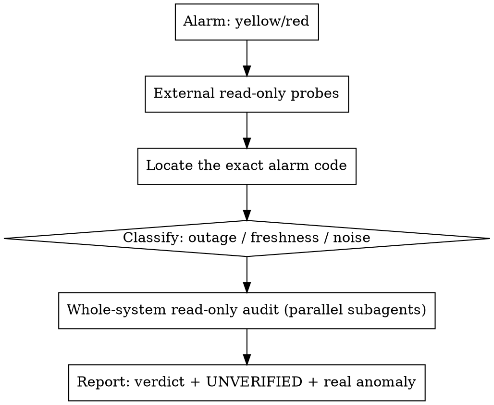

# System Status Triage (tiger-claw-v4-core)

## Overview

**A yellow or red signal is a CLAIM, not a diagnosis.** The tiger-claw admin
dashboard depends on the same infra it monitors, and **most of its alarms are
freshness / absence-of-activity heuristics, not proof of an outage.** Your job
is to establish ground truth read-only, classify the alarm, and report — not to
guess and not to fix mid-triage.

Core principle: **No conclusion without ground truth. No ground truth = mark it
UNVERIFIED.** Don't guess, don't assume, don't pattern-match to a plausible
shape.

## When to use

- Admin dashboard verdict is DEGRADED (yellow) or DOWN (red)
- A dependency card is red (Postgres, Redis, workers, Stripe webhook, Telegram,
  Gemini, synthmon heartbeat, etc.)
- A "Fire-test receipts" row shows FAIL or EVIDENCE_PENDING
- An ops Telegram alert or red banner fires
- Someone says "the system is down" / "X is not firing"

When NOT to use: a confirmed hard outage where `/health` itself returns 503 or
the front door is unreachable — that's `production-debugging-loop`, not triage.

## Iron rules (each closes a real failure)

1. **Read-only until proven.** No edits, no deploys, no config changes during
   triage. *Why: you don't yet know what's actually broken.*
2. **Ground every claim** in either a live probe (curl output) or a
   `file:line` with a quoted snippet. No claim from memory.
3. **Mark UNVERIFIED** anything you cannot check from your current machine
   (live `minutesSinceLast`, secret values, per-instance state, DB rows).
   Most triage stations have **no gcloud and no ADMIN_TOKEN** — say so, don't
   invent access (e.g. don't assume an MCP or token you haven't confirmed).
4. **Classify before concluding:** is this a *true outage*, a *freshness/absence
   alarm*, or *incident-card noise*? (See table.) Don't summarize a freshness
   alarm as "broken infrastructure."
5. **Report, don't fix.** Triage ends in a verdict + the one real anomaly (if
   any) + UNVERIFIED list. Fixing is a separate, approved step.

## Process



**0. External read-only probes first** (no repo needed):
```bash
curl -s -m 15 "https://api.tigerclaw.io/health"            # expect 200 + checks all ok
curl -s -o /dev/null -w "%{http_code}\n" "https://wizard.tigerclaw.io"   # front door
curl -s -o /dev/null -w "%{http_code}\n" -X POST -H "Content-Type: application/json" \
  -d '{}' "https://api.tigerclaw.io/webhooks/stripe"        # unsigned guardrail → expect 400
curl -s -w "\nHTTP %{http_code}\n" -X POST -H "Content-Type: application/json" \
  -d '{}' "https://api.tigerclaw.io/webhooks/stripe/commerce"   # expect 400 (or 503 if secret missing)
```
A 400 to an *unsigned* webhook probe is the **healthy** state — it proves the
endpoint is up and signature-checking. It is NOT the alarm.

**1. Locate the exact alarm code.** Clone read-only
(`gh repo clone bbrysonelite-max/tiger-claw-v4-core /tmp/...`) and find what
computes the alarm. Grep the symbol, not the line number (lines drift). See the
reference table.

**2. Classify the alarm** (see table). State which of the three it is.

**3. Whole-system read-only audit** — dispatch **parallel `Explore`
subagents** (they cannot write), one per subsystem, each required to cite
`file:line` + quoted code and to label anything needing live access UNVERIFIED.
Typical split: (a) the alarm's own pipeline, (b) Stripe/webhooks, (c) dashboard
dependency + incident computation, (d) the affected feature's data capture.

**4. Separate incident-card noise** from real failures (scanner paths, stale
session tokens) using `classifyActiveIncident` — quote the classification.

**5. Report:** verdict (GO / DEGRADED / DOWN), the single genuine anomaly if one
exists, and an explicit UNVERIFIED list of what needs gcloud / ADMIN_TOKEN / DB.

## Ground-truth reference: what each alarm actually measures

Verified against `tiger-claw-v4-core` main (grep the symbol; line numbers drift).

| Alarm | Computed in | Measures | Type |
|---|---|---|---|
| **"Stripe webhook not firing"** | `services/dep_probes.ts` `probeStripeWebhook` (~173) reading `services/webhook_counters.ts` `getWebhookStats` | `minutesSinceLast > 1440` (24h) on an **in-memory per-instance** counter; `null` → "no events yet / ok" | **Freshness** (NOT endpoint reachability) |
| Dependency cards (Postgres/Redis/workers/Telegram/Gemini/Serper/Oxylabs/Resend…) | `dep_probes.ts` (registry ~466) via `status_aggregator.ts getStatusPayload` | active probe (query/ping/HTTP) | **Outage** |
| Synthmon heartbeat | `dep_probes.ts` (~400) — `MAX(created_at)` on `_synthmon_*` conversation_turns | `minutesSinceLast > SYNTHMON_RED_MIN` (def 180) | **Freshness** |
| Fire-test receipt FAIL | `services/fire_test_receipt.ts` | active+only-evidence-gaps stays amber <48h then FAILs (`EVIDENCE_PENDING_MAX_AGE_HOURS=48`); `MIN_ACTIVE_RECEIPT_TURNS=5`; terminal (booked/dead_end) FAILs on any gap incl. booking-metadata mismatch | **Freshness / evidence** |
| Active Incidents / red banner rows | `routes/admin.ts` query on `admin_exceptions` (state='open'); `status_aggregator.ts classifyActiveIncident` | open exception rows; classified scanner_noise / dashboard_auth / unknown | **Noise OR outage** |
| Overall verdict GO/DEGRADED/DOWN | `services/verdict.ts` | critical-down → DOWN; warn-down/stale-heartbeat → DEGRADED | derived |
| `/health` | `routes/health.ts` | postgres reachable + redis ok + workers ok/disabled → 200 | **Outage** |
| Daily checks | `scripts/daily-checks.ts` + `daily_check_runner.ts` | front_door, public_health, admin_status, commerce_unsigned_webhook; severity red pages | mixed |

## Tiger gotchas (the non-obvious truths)

- **Webhook counters are in-memory, per Cloud Run instance** (`webhook_counters.ts`).
  The dashboard may query a *different instance* than Stripe delivers to → false
  red. Not fleet-wide.
- **A wrong webhook secret records as a *failure* but still updates `lastEventAt`**
  → keeps the banner **green**. A green Stripe card does NOT prove provisioning
  works.
- **The commerce webhook (`/stripe/commerce`) never increments the counter** —
  it's invisible to the "Stripe webhook" card; it has its own `provider_events`
  table.
- **Fire-test `qualified_movement` IS emitted in production** every turn
  (`runtime/movementPayload.ts`, both Telegram + LINE) — a missing one means
  *not correlated* (chat_id mismatch) or *aged out*, not "never written."
- **`lead.started_bot` is Telegram-only** (`services/tiger_card.ts`, on `/start`
  Tiger Card claim). LINE has no equivalent.
- **Booking metadata mismatch** (LINE booked FAIL): `source_channel` /
  `source_chat_id` / `tenant_id` embedded by `tools/tiger_book_zoom.ts` and
  stored by `services/calcom_webhooks.ts` must match `conversation_turns.chat_id`
  — LINE userId encoding can differ between the two paths.
- **Scanner rows** (`/.env`, `/phpinfo.php`, stale `MISSING_SESSION_TOKEN`) enter
  Active Incidents legitimately — preserve as evidence, do not panic, do not let
  them bury a real row.

## What needs live access you may not have

`gcloud`, `ADMIN_TOKEN`, or DB/cloud-sql-proxy. Without them you CANNOT verify:
the live `minutesSinceLast`, whether the Stripe secret matches, per-instance
state, or a receipt's exact `missing[]`. **Say UNVERIFIED and name what would
confirm it.** Do not infer a value you cannot read.

## Common mistakes

| Mistake | Reality |
|---|---|
| "Banner is red → system is down" | Most cards are freshness alarms. Probe `/health` and the front door first. |
| "Unsigned probe returned 400 → webhook broken" | 400 unsigned is the **healthy** guardrail. |
| "Stripe card green → payments provision fine" | Wrong secret keeps it green. Green ≠ proven. |
| Assuming gcloud/ADMIN_TOKEN/MCP/Stripe access | Confirm access exists; otherwise mark UNVERIFIED. Don't guess. |
| Concluding from memory | Cite a live probe or `file:line`. |
| Editing code to "fix" during triage | Triage is read-only. Fixing is a separate approved step. |
| Reporting a freshness alarm as "infra broken" | Classify it; quote the threshold. |
```
